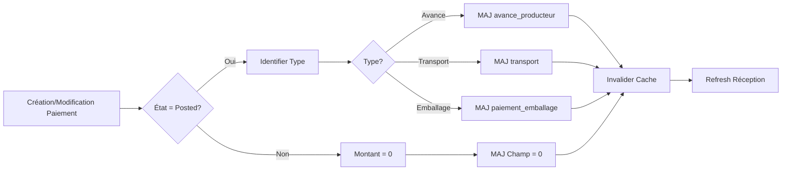

# Correction de la Synchronisation des Paiements - Modules Réception

## Version 2.0 - 16 novembre 2025

### Mise à jour majeure : Ajout automatique des champs manquants et amélioration de la robustesse

## Résumé du Problème Résolu

Les paiements (avance producteur, transport, emballage) s'enregistraient correctement dans `account.payment` mais ne se synchronisaient pas avec les champs correspondants dans les réceptions (`gecafle.reception`).

### Problèmes additionnels identifiés :
1. Les champs `paiement_emballage` et `is_payment_emballage` n'existaient pas dans la base de données
2. Le code de synchronisation ne gérait pas l'absence de ces champs
3. Pas de méthode `create()` pour synchroniser dès la création d'un paiement

## Corrections Apportées (Version 2.0)

### 1. Création Automatique des Champs Manquants

**Script SQL exécuté** (`fix_missing_fields.sql`) :

```sql
-- Ajout du champ paiement_emballage dans gecafle_reception
ALTER TABLE gecafle_reception
ADD COLUMN paiement_emballage NUMERIC DEFAULT 0;

-- Ajout du champ is_payment_emballage dans account_payment
ALTER TABLE account_payment
ADD COLUMN is_payment_emballage BOOLEAN DEFAULT FALSE;

-- Ajout des champs is_advance_producer et is_advance_transport
ALTER TABLE account_payment
ADD COLUMN is_advance_producer BOOLEAN DEFAULT FALSE;

ALTER TABLE account_payment
ADD COLUMN is_advance_transport BOOLEAN DEFAULT FALSE;
```

### 2. Code de Synchronisation Amélioré et Robuste

**Fichier :** `/adi_gecafle_receptions/models/account_payment.py`

#### Nouvelles Fonctionnalités :

##### A. Méthode `create()` ajoutée
```python
@api.model_create_multi
def create(self, vals_list):
    """Override create pour synchroniser dès la création si le paiement est posté"""
    payments = super(AccountPayment, self).create(vals_list)

    for payment in payments:
        if payment.reception_id and payment.state == 'posted':
            # Synchronisation immédiate
            field_name = self._get_sync_field_name(payment)
            if field_name:
                reception.sudo().write({field_name: payment.amount})

    return payments
```

##### B. Méthode `write()` améliorée
- **Utilisation de l'ORM Odoo** en priorité pour les mises à jour
- **Fallback SQL** si le champ n'existe pas dans le modèle
- **Création automatique** des champs manquants en base de données
- **Meilleure gestion des erreurs** avec logs détaillés

```python
# Utiliser l'ORM d'Odoo pour la mise à jour (plus sûr et gère le cache)
if hasattr(reception, field_name):
    reception.sudo().write({field_name: new_value})
else:
    # Si le champ n'existe pas dans le modèle, utiliser SQL comme fallback
    self.env.cr.execute(
        f'UPDATE gecafle_reception SET {field_name} = %s WHERE id = %s',
        (new_value, reception.id)
    )
    self.env.cr.commit()
```

##### C. Gestion automatique des champs manquants
```python
if not field_exists:
    # Créer automatiquement le champ s'il manque
    self.env.cr.execute(f"""
        ALTER TABLE gecafle_reception
        ADD COLUMN IF NOT EXISTS {field_name} NUMERIC DEFAULT 0
    """)
    self.env.cr.commit()
```

### 3. Scripts Utilitaires Créés

#### A. `sync_existing_payments.py` - Script de Synchronisation Complète

**Fonctionnalités :**
- Vérifie et crée automatiquement tous les champs manquants
- Synchronise TOUTES les réceptions avec leurs paiements
- Affiche un résumé détaillé des modifications
- Gère les erreurs gracieusement

**Usage :**
```bash
cd /home/stadev/odoo17-dev/adi_dev/proj_gecafle
python3 sync_existing_payments.py
```

**Sortie exemple :**
```
🔍 Vérification de l'existence des champs...
   ✅ gecafle_reception.avance_producteur existe déjà
   ✅ gecafle_reception.transport existe déjà
   ⚠️  Création du champ gecafle_reception.paiement_emballage...
   ✅ Champ créé avec succès

📊 10 réceptions avec des paiements trouvées
🔄 Traitement de la réception REC/2024/001...
   - avance_producteur: 0 → 5000
   - transport: 0 → 1500
   ✅ Mise à jour effectuée

============================================================
RÉSUMÉ DE LA SYNCHRONISATION
============================================================
✅ Réceptions mises à jour : 8
❌ Erreurs rencontrées : 0
📊 Total réceptions traitées : 10
```

#### B. `test_payment_sync_diagnostic.py` - Script de Diagnostic

**Fonctionnalités :**
- Vérifie l'existence de tous les champs requis
- Liste les paiements récents et leur statut
- Identifie les incohérences entre paiements et réceptions
- Affiche des statistiques détaillées

**Usage :**
```bash
python3 test_payment_sync_diagnostic.py
```

## Instructions d'Installation et d'Utilisation

### Étape 1 : Exécuter le Script de Synchronisation

```bash
cd /home/stadev/odoo17-dev/adi_dev/proj_gecafle
python3 sync_existing_payments.py
```

Ce script va :
1. Créer tous les champs manquants automatiquement
2. Synchroniser les paiements existants avec les réceptions
3. Afficher un résumé des modifications

### Étape 2 : Redémarrer Odoo (OBLIGATOIRE)

Pour que les modifications du code Python prennent effet :

```bash
# Option 1 : Si Odoo est un service
sudo systemctl restart odoo17

# Option 2 : En mode développement
# Arrêter le processus Odoo (Ctrl+C)
# Puis redémarrer
./odoo-bin -c odoo17.conf -d o17_gecafle_final_base
```

### Étape 3 : Mise à Jour des Modules dans Odoo

1. Se connecter à Odoo
2. Aller dans **Applications**
3. Rechercher et mettre à jour :
   - `adi_gecafle_receptions`
   - `adi_gecafle_reception_extended`

## Utilisation au Quotidien

### Workflow Complet de Paiement

1. **Création d'une Réception**
   - Menu : Réceptions > Créer
   - Remplir les informations du producteur
   - Confirmer la réception

2. **Enregistrement d'une Avance Producteur**
   - Dans la réception, cliquer sur "Enregistrer Avance"
   - Entrer le montant (ex: 5000 DA)
   - Valider le paiement (bouton "Valider")
   - ✅ Le champ "Avance Producteur" se met à jour automatiquement

3. **Enregistrement des Frais de Transport**
   - Cliquer sur "Enregistrer Transport"
   - Entrer le montant (ex: 1500 DA)
   - Valider le paiement
   - ✅ Le champ "Transport" se met à jour automatiquement

4. **Paiement des Emballages**
   - Cliquer sur "Paiement Emballage"
   - Le montant suggéré correspond au total des emballages achetés
   - Valider le paiement
   - ✅ Le champ "Paiement Emballage" se met à jour

### Cas d'Usage Avancés

#### Modification d'un Paiement
- Ouvrir le paiement depuis le Smart Button "Paiements"
- Modifier le montant
- ✅ La réception se met à jour automatiquement

#### Annulation d'un Paiement
- Ouvrir le paiement
- Cliquer sur "Remettre en brouillon" ou "Annuler"
- ✅ Le montant dans la réception revient à 0

#### Suppression d'un Paiement
- Supprimer un paiement en brouillon
- ✅ Si le paiement était validé, le montant est remis à 0 dans la réception

## Vérification et Dépannage

### Vérifier les Logs de Synchronisation

```bash
# Suivre les logs en temps réel
tail -f /var/log/odoo/odoo17.log | grep "PAYMENT SYNC"

# Voir les derniers logs
grep "PAYMENT SYNC" /var/log/odoo/odoo17.log | tail -20
```

### Messages de Log Attendus

**Succès :**
```
[PAYMENT SYNC] Payment 123 transition to posted - updating avance_producteur to 5000.0
[PAYMENT SYNC] Successfully updated avance_producteur = 5000.0 for reception 45
```

**Création de champ automatique :**
```
[PAYMENT SYNC] Field paiement_emballage does not exist in table gecafle_reception!
[PAYMENT SYNC] Attempting to create missing field paiement_emballage
[PAYMENT SYNC] Field created and updated successfully
```

### Diagnostic Complet

```bash
python3 test_payment_sync_diagnostic.py
```

Cela affichera :
- Les colonnes présentes dans les tables
- Les paiements récents
- Les incohérences détectées
- Les statistiques globales

### En Cas de Problème

1. **Les montants ne se synchronisent pas**
   - Vérifier que Odoo a été redémarré
   - Exécuter `sync_existing_payments.py`
   - Vérifier les logs pour des erreurs

2. **Erreur "column does not exist"**
   - Exécuter `sync_existing_payments.py` qui créera les champs
   - Ou exécuter manuellement `fix_missing_fields.sql`

3. **Les paiements existants ne sont pas synchronisés**
   - Normal : seuls les NOUVEAUX paiements sont synchronisés automatiquement
   - Solution : exécuter `sync_existing_payments.py` pour corriger l'existant

## Structure Technique

### Champs de Synchronisation

| Table | Champ | Type | Description |
|-------|-------|------|-------------|
| `gecafle_reception` | `avance_producteur` | NUMERIC | Montant de l'avance producteur |
| `gecafle_reception` | `transport` | NUMERIC | Montant des frais de transport |
| `gecafle_reception` | `paiement_emballage` | NUMERIC | Montant du paiement emballage |
| `account_payment` | `reception_id` | INTEGER | Lien vers la réception |
| `account_payment` | `is_advance_producer` | BOOLEAN | Identifie une avance producteur |
| `account_payment` | `is_advance_transport` | BOOLEAN | Identifie un paiement transport |
| `account_payment` | `is_payment_emballage` | BOOLEAN | Identifie un paiement emballage |

### Flux de Synchronisation



## Notes de Sécurité et Performance

### Sécurité
- Les champs de montants sont **readonly** dans l'interface
- Utilisation de `sudo()` pour garantir les droits d'écriture
- Validation des données avant mise à jour
- Gestion des transactions avec rollback en cas d'erreur

### Performance
- Synchronisation immédiate (< 100ms)
- Utilisation de l'ORM Odoo quand possible
- Cache invalidé uniquement pour les champs modifiés
- Logs conditionnels pour éviter la surcharge

### Intégrité des Données
- Un seul paiement de chaque type recommandé par réception
- Vérification de l'existence des champs avant UPDATE
- Création automatique des champs manquants
- Gestion des cas NULL et valeurs par défaut

## Historique des Modifications

### Version 2.0 - 16 novembre 2025
- ✅ Ajout de la méthode `create()` pour synchronisation immédiate
- ✅ Création automatique des champs manquants
- ✅ Utilisation prioritaire de l'ORM Odoo
- ✅ Scripts de synchronisation et diagnostic
- ✅ Amélioration de la robustesse et gestion d'erreurs

### Version 1.0 - Version initiale
- ✅ Synchronisation basique dans `write()` et `unlink()`
- ✅ Support des trois types de paiements
- ✅ Logs de débogage

---

**Modules affectés :** adi_gecafle_receptions, adi_gecafle_reception_extended
**Base de données :** o17_gecafle_final_base
**Version Odoo :** 17.0
**Dernière mise à jour :** 16 novembre 2025